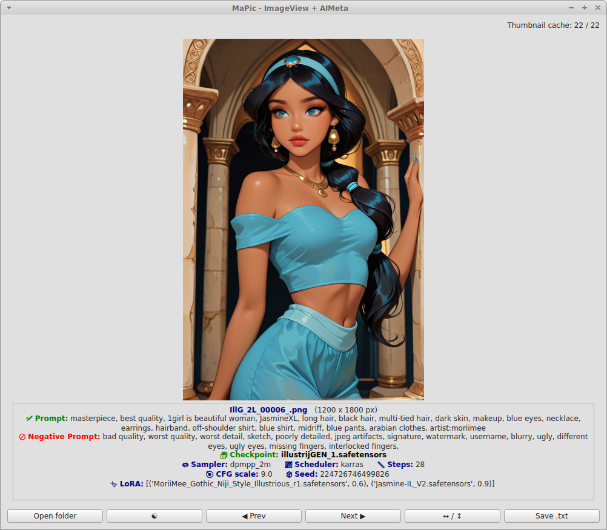

# MaPic – Image Viewer and AI Metadata Reader

## Description
MaPic is an advanced image viewer designed for both casual browsing and professional use with AI-generated images. It can display images in full size or as thumbnails, and extract AI metadata (prompts, models, LoRAs, seeds, etc.) from PNG and JPG (jpg/jpeg) files created by ComfyUI, A1111, and other AI workflows.

## Features
- Full-size image viewing with navigation (next/previous) using arrow keys
- Scrollable thumbnail grid, dynamically adjusted to window size
- Caching of thumbnails for faster browsing
- Extraction of AI-generated metadata:
  - Prompt / Negative prompt
  - Model / Checkpoint
  - Sampler, Scheduler, Steps, CFG scale
  - Seed, VAE
  - Multiple LoRAs with weights (supports `<lora:name:weight>` and JSON formats)
- Support for both PNG parameters and JPG UserComment metadata
- Responsive GUI with PyQt6
- Dark/Light mode, automatically detects system theme
- Save metadata to TXT files
- Supports imageview orientation (landscape/portrait)
- Automatically loads all images from the folder where MaPic2 was launched. Open folder can change..


## Usage
1. Launch MaPic:
```
python Mapic2.py
```
2. Open a folder of images:
   - Click the **Open Folder** button in the interface.
3. Switch between full-size image view and thumbnail view:
   - Click on an image to open thumbnail view.
   - Click a thumbnail to view the full-size image.
4. Navigate images:
   - Use **arrow keys** to move forward/backward (or left/right).
   - Orientation-aware display (landscape and portrait supported).
5. View AI metadata:
   - Metadata is displayed under each image, including prompts, Checkpoints, LoRAs, seed, step, sampler, scheduler and cfg parameters.



## Installation & Running
1. Install recommended Python 3.11 (higher not tested).
2. Install dependencies (need to download my requirements.txt): 
```bash
pip install -r requirements.txt
```
OR 
```
pip install PyQt6
pip install Pillow
pip install exifread
```
3. Ensure `exiftool` is installed for JPG metadata extraction:
```
sudo apt install exiftool   # Linux
```
4. Download or clone MaPic repository: Mapic2.py, MaPic.ico, requirements.txt, MaPic2_Readme.md
5. Run:
```
python Mapic2.py
```

## Author
Developed by **Majika77** with assistance from *ChatGPT (OpenAI GPT-5 mini)*

